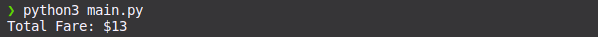
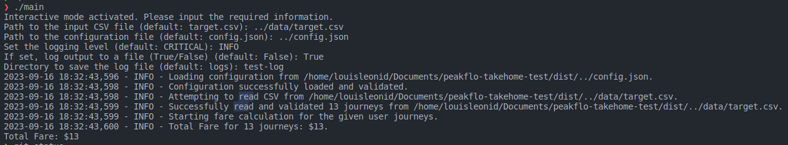
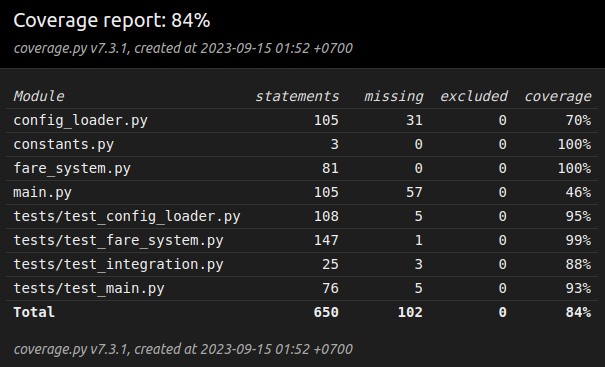
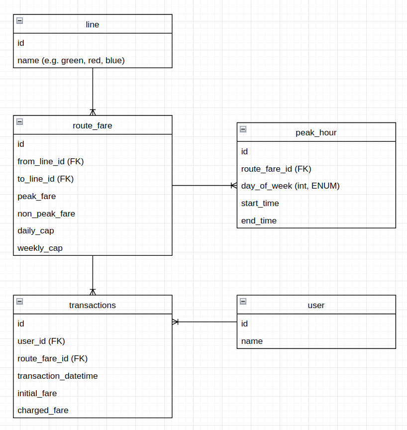

# Fare System  

[](https://codecov.io/gh/leonidlouis/peakflo-takehome-test)

A fare calculation system for a fictional public transportation network.

## Features

- Computes fare based on journey details.
- Considers peak hours for fare adjustments.
- Implements daily and weekly fare caps.
- Reads and processes CSV files containing journey records.
- **Interactive mode**: if no arguments are provided, the program will prompt the user for inputs interactively.

## Getting Started

### Prerequisites
Before running the program:

- Python 3.x installed
- `pip` for package management
- Set up your `config.json` first, an example configuration is provided in the repository as reference (`config.json.example`)
- Replace placeholder `target.csv` file in the `data` directory with your actual journey data. (by default, this is what the program will use, unless you explicitly call the `--filepath` argument)

### Installation

1. Clone this repository.
```bash
git clone https://github.com/leonidlouis/peakflo-takehome-test
```
2. Navigate to the project directory.
```bash
cd peakflo-takehome-test
```
3. Set up virtual environment
```bash
python3 -m venv .venv
```
4. Activate the virtual environment.
```bash
source .venv/bin/activate
```
5. Install the required packages.
```bash
pip install -r requirements.txt
```
6. Set up `pre-commit` hooks *(optional, not needed if you're not going to contribute to the repo)*
```bash
pre-commit install
```
7. Run the program.
```bash
python main.py
```
#### Installation Note
While *it's possible* to skip steps 2 through 6, it's **not recommended**. Doing so would utilize your system's global `python3` environment, which might lead to potential conflicts with other projects or libraries. Following all the steps ensures you are working in a clean, isolated environment specific to this project.

## Usage
### Interactive Mode

If no command-line arguments are provided, the program will operate in interactive mode, prompting the user for inputs step-by-step.

### Command Line Arguments
The application supports a range of arguments for flexibility:
- `--filepath`: Specify a path to your input CSV file (default: `data/target.csv`).
- `--log-level`: Set the logging level. Options are: `DEBUG`, `INFO`, `NONE`, and `CRITICAL`
  - `CRITICAL`(default): This will write to the console only application-breaking logs.
  - `INFO`: This will write to the console basic information regarding the application.
  - `NONE`: This will not write anything, anywhere, and suppress logging.
  - `DEBUG`: This will write to the console highly granular/detailed information regarding the application.
- `--write-log`: Flag to enable writing logs to a file in the custom directory (default: `False`).
- `--log-dir`: Specify the directory where log files should be saved (default: `logs`).
- `--config-filepath`: Specify a path to the configuration file (default: `config.json`).


Run the `main.py` script with the appropriate command line arguments.
Some examples:

1. Running script to calculate default file: `data/target.csv` with `config.json`
```bash
python main.py
```
2. Running script to calculate custom user file: `data/custom_user_file.csv` with `config.json`
```bash
python main.py --filepath=data/custom_user_file.csv
```
3. Running script to calculate custom user file: `data/custom_user_file.csv` with `custom_line_config.json`
```bash
python main.py --filepath=data/custom_user_file.csv --config-filepath=custom_line_config.json
```
4. Running script to calculate custom user file: `data/custom_user_file.csv` with `custom_line_config.json` with granular/detailed logs, and write that log to a logfile in the `logs` directory
```bash
python main.py --filepath=data/custom_user_file.csv --config-filepath=custom_line_config.json --log-level=DEBUG --write-log --log-dir=logs
```

Sample output when using the application:



### Building the Executable
If you want to create an executable for your specific platform, you can use PyInstaller. Here are the steps:
1. Build the executable.
```bash
pyinstaller --onefile main.py
```
2. Locate the generated executable in the `dist` directory.
```bashs
cd dist
```
3. On Linux, you might have to set the file as executable (TODO: Find out the behaviour of this for Windows and MacOS).
```bash
chmod +x main
```
Now you have an executable that you can run on your specific platform. 

Running the executable looks like this:


Note: 
1. `pyinstaller` **cannot cross-compile**, as in, if you generate the executable on Linux, it will **only** run on that specific platform, vice versa for MacOS and Windows.
2. Both relative path and absolute path is supported when entering file / directory paths on the executable.

## Tests
[Click Here](https://app.codecov.io/gh/leonidlouis/peakflo-takehome-test) to see the latest coverage report.

Unit & integration tests are provided in `tests` directory. It is automatically run when:
1. The `pre-commit` hook for `git commit` will trigger the test.
2. Whenever there's a `push` or `pull request` to the `master` branch. (automated via Github Actions)
### Running Tests Separately
You can run unit tests independently with:
```bash
python -m unittest discover -q tests
```
please note that currently, all tests are successful, but some of the `CRITICAL` outputs when Negative Testing/Failure Testing cannot be suppressed/silenced. (see below) (TODO)


### HTML Test Coverage Report
You can generate a visual of the test coverage report by running
```bash
coverage run -m unittest discover tests
coverage html
```
then, you can see the `html` generated in `htmlcov/index.html`, for reference, it looks like this:


## Production Application
While this repo should already fulfill the initial requirement for the take home test, I've designed a super simple ERD below as a reference to what an actual (albeit simplified) Fare Calculation System for Singa Metro Authority could look like.

