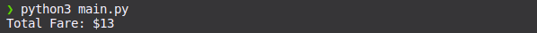
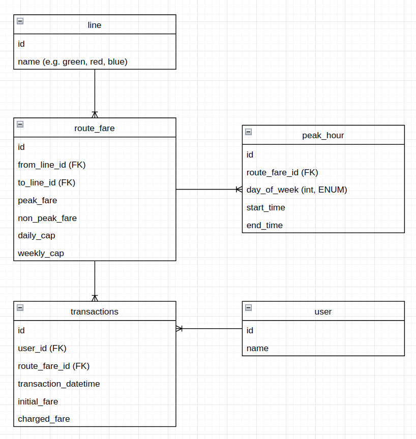

# Fare System

A fare calculation system for a fictional public transportation network.

## Features

- Computes fare based on journey details.
- Considers peak hours for fare adjustments.
- Implements daily and weekly fare caps.
- Reads and processes CSV files containing journey records.

## Getting Started

### Prerequisites
Before running the program:

- Python 3.x installed
- Set up your `config.json` first, an example configuration is provided in the repository as reference (`config.json.example`)
- Replace placeholder `target.csv` file in the `data` directory with your actual journey data. (by default, this is what the program will use, unless you explicitly call the `--filepath` argument)

### Installation

1. Clone this repository.
```bash
git clone https://github.com/leonidlouis/peakflo-takehome-test
```
2. Navigate to the project directory.
```bash
cd peakflo-takehome-test
```
3. Run the program.
```bash
python3 main.py
```
### Command Line Arguments
The application supports a range of arguments for flexibility:
- `--filepath`: Specify a path to your input CSV file (default: `data/target.csv`).
- `--log-level`: Set the logging level. Options are: `DEBUG`, `INFO`, `NONE`, and `CRITICAL`
  - `CRITICAL`(default): This will write to the console only application-breaking logs.
  - `INFO`: This will write to the console basic information regarding the application.
  - `NONE`: This will not write anything, anywhere, and suppress logging.
  - `DEBUG`: This will write to the console and logfile in `logs` directory highly granular/detailed information regarding the application.
- `--config-filepath`: Specify a path to the configuration file (default: `config.json`).
- `--skip-tests`: Use this flag to skip running tests, not intended to be used, originally for `tests/test_integration.py`.

## Usage
Run the `main.py` script with the appropriate command line arguments.
Some examples:

1. Running script to calculate default file: `data/target.csv` with `config.json`
```bash
python3 main.py
```
2. Running script to calculate custom user file: `data/custom_user_file.csv` with `config.json`
```bash
python3 main.py --filepath=data/custom_user_file.csv
```
3. Running script to calculate custom user file: `data/custom_user_file.csv` with `custom_line_config.json`
```bash
python3 main.py --filepath=data/custom_user_file.csv --config-filepath=custom_line_config.json
```
4. Running script to calculate custom user file: `data/custom_user_file.csv` with `custom_line_config.json` with granular/detailed logs (log will be outputted to `logs` directory)
```bash
python3 main.py --filepath=data/custom_user_file.csv --config-filepath=custom_line_config.json --log-level=DEBUG
```

Sample output when using the application:

## Tests
Unit & integration tests are provided in `tests` directory. Whenever `main.py` is called through the command line, it will first execute these tests before calculating the fare. Application will exit if there's an error in the test.
### Running Tests Separately
You can run unit tests independently with:
```bash
python3 -m unittest discover -q tests
```
please note that currently, all tests are successful, but some of the `CRITICAL` outputs when Negative Testing/Failure Testing cannot be suppressed/silenced. (see below) (TODO)


## Production Application
While this repo should already fulfill the initial requirement for the take home test, I've designed a super simple ERD below as a reference to what an actual (albeit simplified) Fare Calculation System for Singa Metro Authority could look like.

